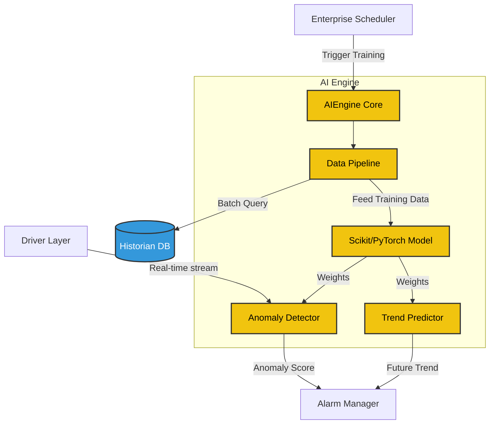

# AI Pipeline Component Diagram

Shows the internal breakdown of the AI prediction framework.

```mermaid
graph TD
    classDef comp fill:#f1c40f,stroke:#333,stroke-width:2px,color:#000
    classDef data fill:#3498db,stroke:#333,stroke-width:2px,color:#fff

    Scheduler[Enterprise Scheduler]
    
    subgraph AI Engine
        Core[AIEngine Core]:::comp
        Pipeline[Data Pipeline]:::comp
        Model[Scikit/PyTorch Model]:::comp
        Detector[Anomaly Detector]:::comp
        Predictor[Trend Predictor]:::comp
    end

    Historian[(Historian DB)]:::data
    DAL[Driver Layer]
    AlarmMgr[Alarm Manager]

    Scheduler -- Trigger Training --> Core
    Core --> Pipeline
    Pipeline -- Batch Query --> Historian
    Pipeline -- Feed Training Data --> Model
    
    DAL -- Real-time stream --> Detector
    Model -- Weights --> Detector
    Model -- Weights --> Predictor
    
    Detector -- Anomaly Score --> AlarmMgr
    Predictor -- Future Trend --> AlarmMgr
```
