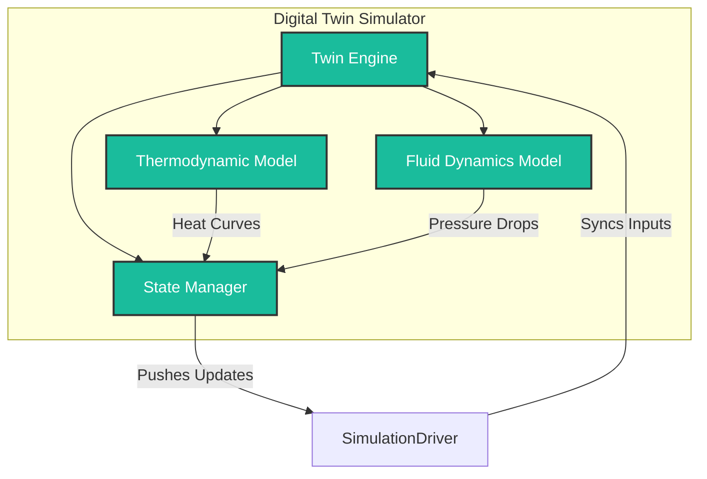

# Digital Twin Component Diagram

Shows the structure of the simulation engine.

```mermaid
graph TD
    classDef comp fill:#1abc9c,stroke:#333,stroke-width:2px,color:#fff
    
    subgraph Digital Twin Simulator
        TwinCore[Twin Engine]:::comp
        Thermo[Thermodynamic Model]:::comp
        Fluid[Fluid Dynamics Model]:::comp
        State[State Manager]:::comp
    end

    DAL[SimulationDriver]
    
    DAL -- Syncs Inputs --> TwinCore
    TwinCore --> State
    TwinCore --> Thermo
    TwinCore --> Fluid
    
    Thermo -- Heat Curves --> State
    Fluid -- Pressure Drops --> State
    
    State -- Pushes Updates --> DAL
```
