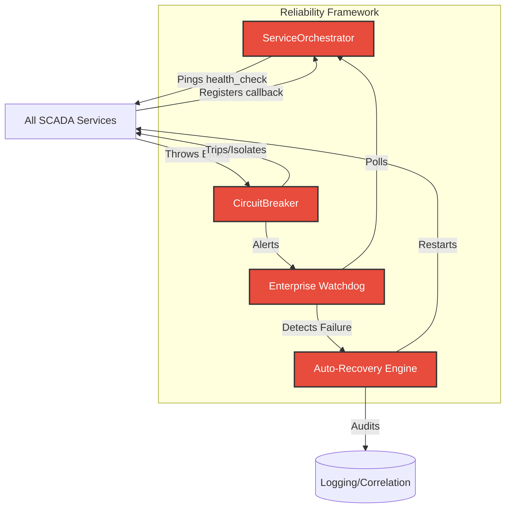

# Reliability Framework Component Diagram

Shows how the system monitors and recovers itself.

```mermaid
graph TD
    classDef comp fill:#e74c3c,stroke:#333,stroke-width:2px,color:#fff
    
    subgraph Reliability Framework
        Orchestrator[ServiceOrchestrator]:::comp
        Watchdog[Enterprise Watchdog]:::comp
        Breaker[CircuitBreaker]:::comp
        Recovery[Auto-Recovery Engine]:::comp
    end

    Services[All SCADA Services]
    Logs[(Logging/Correlation)]
    
    Services -- Registers callback --> Orchestrator
    Orchestrator -- Pings health_check --> Services
    
    Watchdog -- Polls --> Orchestrator
    Watchdog -- Detects Failure --> Recovery
    
    Services -- Throws Errors --> Breaker
    Breaker -- Trips/Isolates --> Services
    Breaker -- Alerts --> Watchdog
    
    Recovery -- Restarts --> Services
    Recovery -- Audits --> Logs
```
