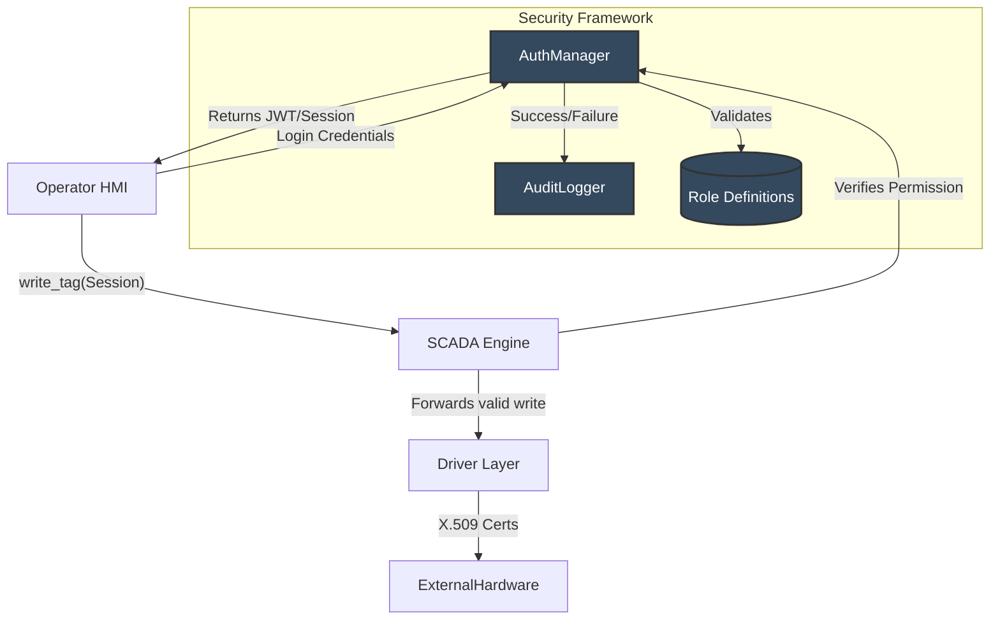

# Security Framework Component Diagram

Shows the Role-Based Access Control and authentication mechanisms.

```mermaid
graph TD
    classDef comp fill:#34495e,stroke:#333,stroke-width:2px,color:#fff
    
    subgraph Security Framework
        Auth[AuthManager]:::comp
        Audit[AuditLogger]:::comp
        Roles[(Role Definitions)]:::comp
    end

    HMI[Operator HMI]
    DAL[Driver Layer]
    SCADA[SCADA Engine]
    
    HMI -- Login Credentials --> Auth
    Auth -- Validates --> Roles
    Auth -- Returns JWT/Session --> HMI
    
    HMI -- write_tag(Session) --> SCADA
    SCADA -- Verifies Permission --> Auth
    
    Auth -- Success/Failure --> Audit
    SCADA -- Forwards valid write --> DAL
    
    DAL -- X.509 Certs --> ExternalHardware
```
