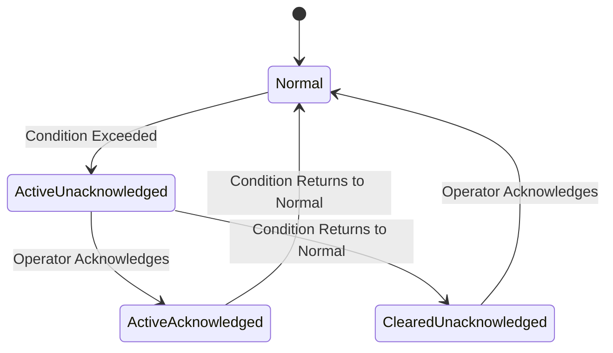

# Alarm Lifecycle Data Flow Diagram

Illustrates the ISA-18.2 compliant state machine for alarms.

```mermaid
stateDiagram-v2
    [*] --> Normal
    
    Normal --> ActiveUnacknowledged : Condition Exceeded
    
    ActiveUnacknowledged --> ActiveAcknowledged : Operator Acknowledges
    ActiveUnacknowledged --> ClearedUnacknowledged : Condition Returns to Normal
    
    ActiveAcknowledged --> Normal : Condition Returns to Normal
    
    ClearedUnacknowledged --> Normal : Operator Acknowledges
```
