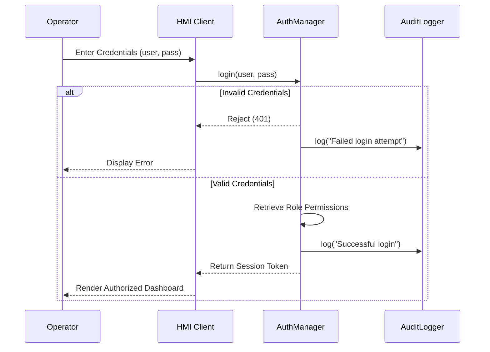

# Authentication Data Flow Diagram

Illustrates how operators gain access to the system.

```mermaid
sequenceDiagram
    participant User as Operator
    participant HMI as HMI Client
    participant Auth as AuthManager
    participant Audit as AuditLogger

    User->>HMI: Enter Credentials (user, pass)
    HMI->>Auth: login(user, pass)
    
    alt Invalid Credentials
        Auth-->>HMI: Reject (401)
        Auth->>Audit: log("Failed login attempt")
        HMI-->>User: Display Error
    else Valid Credentials
        Auth->>Auth: Retrieve Role Permissions
        Auth->>Audit: log("Successful login")
        Auth-->>HMI: Return Session Token
        HMI-->>User: Render Authorized Dashboard
    end
```
