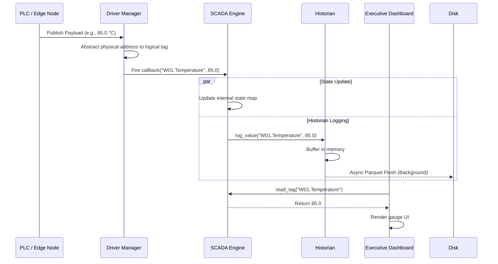

# Telemetry Data Flow Diagram

Illustrates the path of a single data point from a physical sensor to the operator dashboard.

```mermaid
sequenceDiagram
    participant Sensor as PLC / Edge Node
    participant DAL as Driver Manager
    participant Core as SCADA Engine
    participant Hist as Historian
    participant Dash as Executive Dashboard

    Sensor->>DAL: Publish Payload (e.g., 85.0 °C)
    DAL->>DAL: Abstract physical address to logical tag
    DAL->>Core: Fire callback("W01.Temperature", 85.0)
    
    par State Update
        Core->>Core: Update internal state map
    and Historian Logging
        Core->>Hist: log_value("W01.Temperature", 85.0)
        Hist->>Hist: Buffer in memory
        Hist-->>Disk: Async Parquet Flush (Background)
    end
    
    Dash->>Core: read_tag("W01.Temperature")
    Core-->>Dash: Return 85.0
    Dash->>Dash: Render gauge UI
```
