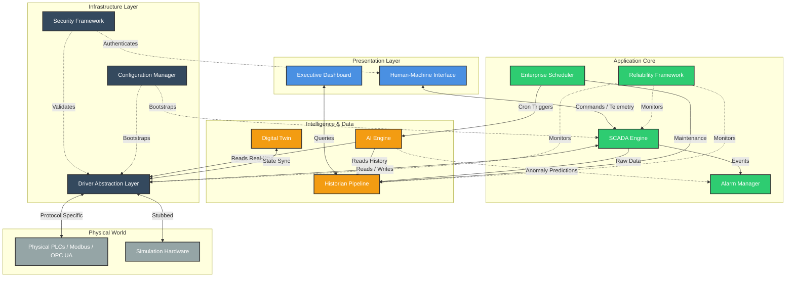

# System Architecture Diagram

This diagram illustrates the high-level macroscopic architecture of the DikiliGeothermal SCADA Platform.

## Core Topography

```mermaid
graph TD
    %% Define styles
    classDef ui fill:#4a90e2,stroke:#333,stroke-width:2px,color:#fff
    classDef core fill:#2ecc71,stroke:#333,stroke-width:2px,color:#fff
    classDef data fill:#f39c12,stroke:#333,stroke-width:2px,color:#fff
    classDef infra fill:#34495e,stroke:#333,stroke-width:2px,color:#fff
    classDef external fill:#95a5a6,stroke:#333,stroke-width:2px,color:#fff

    subgraph "Presentation Layer"
        HMI[Human-Machine Interface]:::ui
        Dashboard[Executive Dashboard]:::ui
    end

    subgraph "Application Core"
        SCADA[SCADA Engine]:::core
        AlarmMgr[Alarm Manager]:::core
        Scheduler[Enterprise Scheduler]:::core
        Rel[Reliability Framework]:::core
    end

    subgraph "Intelligence & Data"
        Historian[Historian Pipeline]:::data
        Twin[Digital Twin]:::data
        AI[AI Engine]:::data
    end

    subgraph "Infrastructure Layer"
        DAL[Driver Abstraction Layer]:::infra
        Sec[Security Framework]:::infra
        Config[Configuration Manager]:::infra
    end

    subgraph "Physical World"
        PLC[Physical PLCs / Modbus / OPC UA]:::external
        Sim[Simulation Hardware]:::external
    end

    %% Interactions
    HMI <-->|Commands / Telemetry| SCADA
    Dashboard <-->|Queries| Historian
    
    SCADA -->|Events| AlarmMgr
    SCADA -->|Raw Data| Historian
    SCADA <-->|Reads / Writes| DAL
    
    Scheduler -->|Cron Triggers| AI
    Scheduler -->|Maintenance| Historian
    
    AI -->|Reads History| Historian
    AI -->|Reads Real-time| DAL
    AI -.->|Anomaly Predictions| AlarmMgr
    
    Twin <-->|State Sync| DAL
    
    DAL <-->|Protocol Specific| PLC
    DAL <-->|Stubbed| Sim
    
    Rel -.->|Monitors| SCADA
    Rel -.->|Monitors| Historian
    Rel -.->|Monitors| DAL
    
    Sec -.->|Authenticates| HMI
    Sec -.->|Validates| DAL
    
    Config -.->|Bootstraps| SCADA
    Config -.->|Bootstraps| DAL
```
